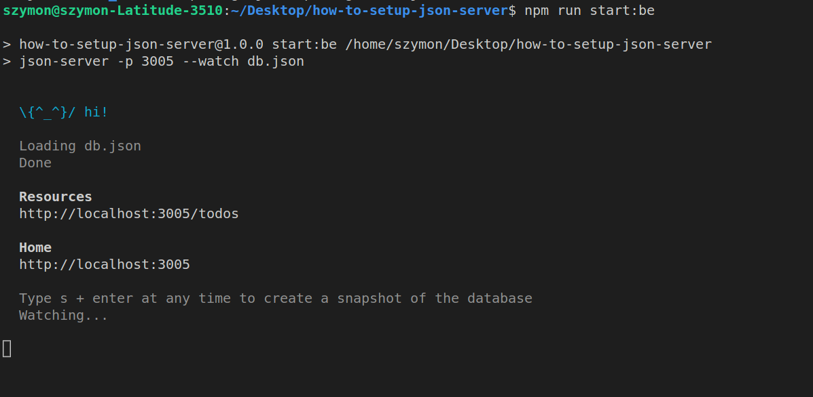

# Jak stworzyć mockowy backend (ultra prosty 😉)

### Krok 1

Do stworzenia mockowego backendu który możemy uruchomić loklanie (tzn na naszych komputerach - ale i nie tylko) będziemy używali paczki npm-owej o nazwie _json-server_ znajdziesz ją pod tym linkiem

https://www.npmjs.com/package/json-server

żeby zainstalować paczkę musisz posiadać zainicjalizowany projekt nodowy (musisz mieć plik package.json) - możesz stowrzyć to jako oddzielny projekt albo w obrębie projektu nad którym pracujesz np projekt react-owy.

paczkę zainstalujesz za pomocą komendy

```
npm install json-server
```

pamiętaj żeby wywołać tę komendę w obrębie folderu w którym znajduje się plik package.json

### Krok 2

Po zainstalowaniu paczki json-server trzeba z niej skorzystać 😉

jest kilka czynności które należy wykonać żeby skorzystać z tej paczki:

- stworzenie pliku db.json który będzie trzymał/symulował baze danych i backend za jednym razem
  plik ten powinien zawierać obiekt w formacie json który reprezentuje naszą bazę dancyh i endpointy
- stworzenie komendy/skryptu w pliku package.json w sekcji "scripts" która uruchomi backend

zacznijmy od stworzenia komendy która uruchomi nasz backendu
w pliku package.json w skecji scripts musimy dodać nowy klucz oraz nową wartość

```
  "scripts": {
    "start:be": "json-server -p 3005 --watch db.json"
  }
```

ta linijka w pliku packege.json spowoduje to że po wywołaniu poniżeszj komendy w terminalu
nasz symulowany/mockowy backend się uruchomi

- json-server - jest paczką którą zainstalowaliśmy i możemy ją WYWOŁAĆ/URUCHOMIĆ
- --watch - jest to tzw flaga która sprawia że jeżeli coś zmienimy w pliku db.json i zapiszemy nasz mockowy backedn się odświeży samoistnie bez wyłączania i włączania backednu
- -p 3005 - kolejna flaga która określa na jakim porcie ma być uruchomiony nasz backend - oznacza to tyle że backend będzie dostępny pod następującym URL-em

http://localhost:3005/

```
npm run start:be
```

zanim jednak wywołamy powyższą komendę należy stworzyć plik db.json oraz dodać jakieś dane

### Krok 3

Dodajmy trochę danych

w pliku db.json nalezy określić dane jakie chcemy żeby były dostępne i serwowane w naszym backendzie

np.
w pliku db.json dodaj to co poniżej

```
{
    "todos": [
        {
            "id": 1,
            "title": "pouczyć się JSa"
        },
        {
            "id": 2,
            "title": "pouczyć się CSSa"
        }
    ]
}
```

dane określone w pliku będą dostępne po wykonaniu requestu HTTP
pod następujący endpoint

```
http://localhost:3005/todos
```

request możesz wykonać z poziomu przeglądarki tzn

wklej powyższy link w pasku URL w przeglądarce - przeglądarka wykona request pod ten
endpoint przy pomocy metody GET - pamiętaj będzie to działało gdy backend będzie włączony/uruchomiony tzn w następnym kroku

### Krok 4

Uruchomienie backendu

żeby uruchomić skonfigurowany mockowy backend należy wywołać poniższą komendę w obrębie projektu
w którym został utworzony plik db.json oraz package.json

```
npm run start:be
```

jeżeli wszystko zostało wykonane zgodnie z opisem
po wywołaniu powyżeszj komendy w teminalu powininen być widoczny komunikat widoczny poniżej



### Krok 5

Jak skorzystać z tego endpointu?

Żeby pobrać te dane w projekcie JS-owym
należy skorzystać z tzw klienta http może to być np funkcje fetch

po uruchomieniu backendu możesz wywołać poniższy kod żeby pobrać dane
i wyświetlić konsoli (w tej chiwli możesz zrobić cokolwiek chcesz/potrzebujesz)

```
fetch('http://localhost:3005/todos')
    .then((response)=>response.json())
    .then((data)=>{ console.log(data) })
```

### Krok 6

Repozytorium któro zawiera plik który czytasz posiada juz skonfigurowany backend
śmiało możesz go pobrać (git clone) zainstalować dependecies (npm install) (zależnosci - paczkę json-server)
oraz użyć (npm run start:be)

### Krok 7

dodatkowe materiały

https://www.youtube.com/watch?v=1zkgdLZEdwM
